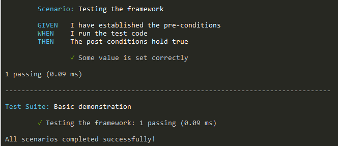

Learn how to specify and test the behavior of your application.

## TODOs

:::danger Important stuff is still missing here

* Link to auto-generated API docs for the testing primitives
* Add automated testing for the code snippets
* Link to downloadable example repository
* Actually embed ``RedGreenRefactor`` into the ``evo`` runtime
* Implement the spec file parser and embed it, too
* Implement the assertion library
* Split into multiple docs, one per docType

:::

## Testing Workflow

The ``evo`` runtime ships with builtin testing primitives that allow you to hierarchically organize your tests:

* Create top-level containers for use-cases in the form of one or many ``TestSuite`` instances
* Define the specification for each test case as a ``Scenario`` instance
* Add any number of scenarios to a given test suite to "queue" them up
* Run any number of test suites to execute the scenarios and display a report

You don't have to install anything to use them in your application; they're made available to all scripts out of the box.

## Methodology

The reports generated roughly adhere to the [behavior-driven development](https://en.wikipedia.org/wiki/Behavior-driven_development) philosophy. You can define an executable specification for your program's behaviour in a ``Scenario``, and (optionally) label it with standardized keywords:

* ``GIVEN``: Describes the state of the environment before executing the code under test ("pre-conditions")
* ``WHEN``: The code you want to test goes here
* ``THEN``: Describes the expected state of the environment after running the code under test ("post-conditions")

The above terminology loosely maps to the typical flow of ``setup`` - ``test`` - ``teardown`` you'd encounter in [xUnit](https://en.wikipedia.org/wiki/XUnit) style tests.

## Running Tests

All you have to do is create a file that defines one or multiple test suites:

```lua title="my-test-suite.lua"
	-- Whatever name or description you set here will be displayed in the final report
	local testSuite = TestSuite:Construct("Basic demonstration")

	local listOfScenarioFilesToLoad = {
		"./example-scenario.lua"
	}

	testSuite:AddScenarios(listOfScenarioFilesToLoad)

	-- Return test suite instance as a Lua module
	return testSuite
```

Any test suite consist of a module that returns the ``TestSuite`` instance, which loads ``Scenario`` instances like this one:

```lua title="example-scenario.lua"
	-- Whatever name or description you set here will be displayed in the final report
	local scenario = Scenario:Construct("Testing the framework")

	-- Whatever name or description you set here will be displayed in the final report
	-- Labelling the individual phases is optional, but highly recommended
	-- You can think of this notation as a shortcut for something like scenario:SetLabel("GIVEN", "Your text")
	scenario:GIVEN("I have established the pre-conditions")
	scenario:WHEN("I run the test code")
	scenario:THEN("The post-conditions hold true")

	-- Event handlers can be overridden to implement a simulation of the scenario you're testing
	function scenario:OnSetup()
			-- This function should run all setup code and establish the preconditions you expect
	end

	function scenario:OnRun()
			-- This function should run the code that you want to test
			self.someValue = 42
	end

	function scenario:OnEvaluate()
		-- This function should assert the expected post-conditions, using standard assertions
			assert(self.someValue == 42, "Some value is set correctly")
	end

	function scenario:OnCleanup()
		-- This should undo any setup you've had to do to establish the pre-conditions
	end

	-- Return scenario instance as a Lua module
	return scenario
```

You can then create and invoke a script that loads and runs a test suite normally, the so-called "test runner":

```lua title="run-my-tests.lua"
	local testSuite = import("./my-test-suite.lua")
	testSuite:Run()
```

Executing this with ``evo run-my-tests.lua`` should result in the following report being displayed:



You can also import multiple test suites, and run them with a simple for loop instead:

```lua title="run-ALL-the-tests.lua"
	local testSuites = {
		"./my-test-suite.lua",
		"./another-test-suite.lua"
		-- You can add as many entries as you like here
	}

	for _, filePath in pairs(testSuites) do
		local testSuite = import(filePath)
		testSuite:Run()
	end
```

Each test suite will run all of its scenarios and display a report before the next one is started, then the next, and so on.

## Limitations

Since the approach to testing described here is simple by design, there are some limitations:

* Nested hierarchies of tests are not supported, although you can of course organize each ``Scenario`` however you like
* Only the standard Lua  ``assert`` function can currently be used to label assertions in the final report (for now)
* Asynchronous tests (using callbacks) aren't currently supported, though you can use [coroutines](https://www.lua.org/pil/9.1.html) if you want this

If you need more features or you dislike the structure that writing BDD-style tests imposes, there may be other options.

## Alternatives

Naturally, you don't need to use the provided testing primitives if you don't want to. Any standard Lua testing framework, such as [busted](https://github.com/Olivine-Labs/busted) or [LuaUnit](https://luarocks.org/modules/bluebird75/luaunit), should work as long as it only uses Lua 5.1 and [supported Lua 5.2 features](https://luajit.org/extensions.html). You could even create your own test runner, or use a native (C/C++) library via LuaJIT's [foreign function interface (FFI)](https://luajit.org/ext_ffi.html).

However, the facilities described here are "officially" maintained. They're guaranteed to see updates when changes to the runtime and the environment necessitate it, while all other solutions are likely to require maintenance on your part.

If you're unhappy with the way that tests work, please open an issue or otherwise give feedback to help make it better!
